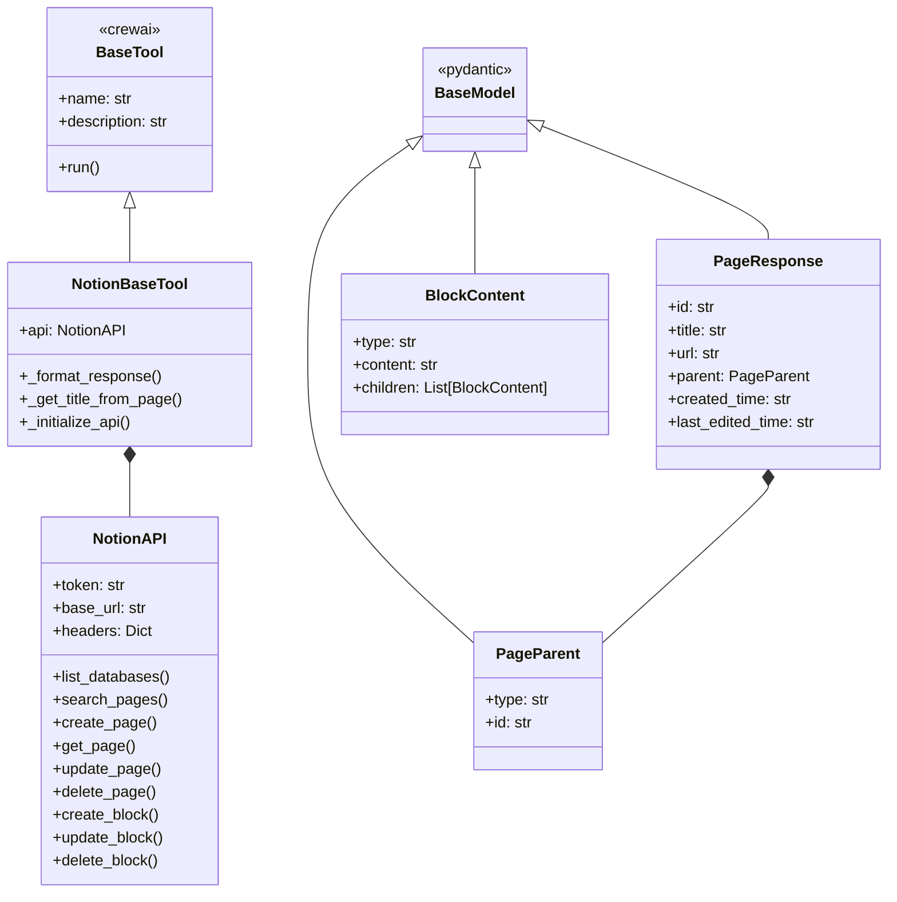
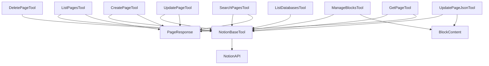
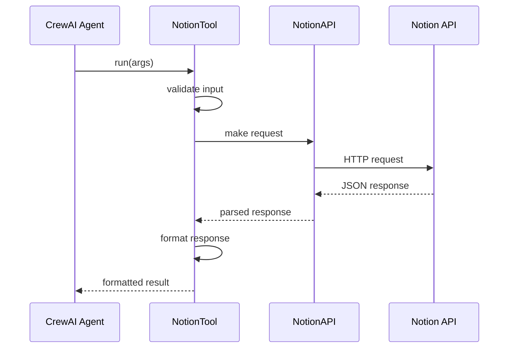
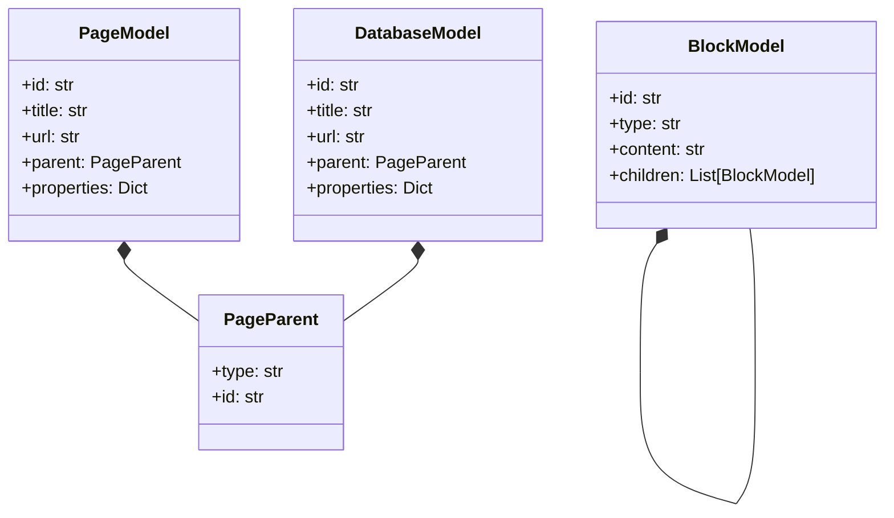
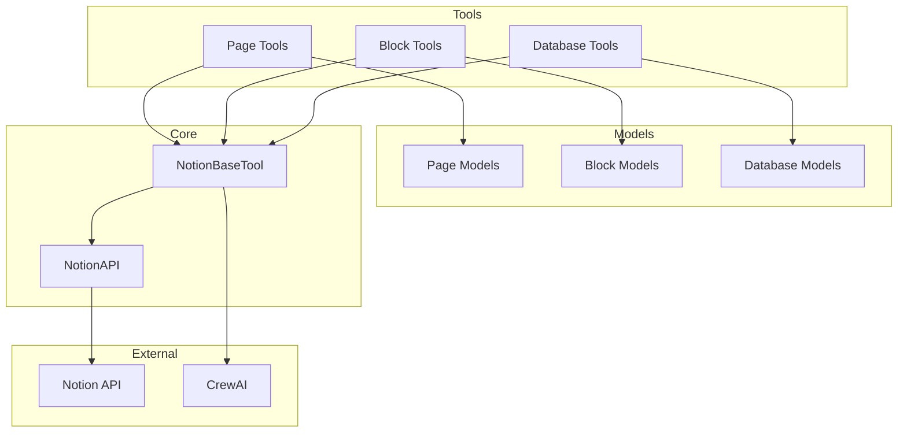
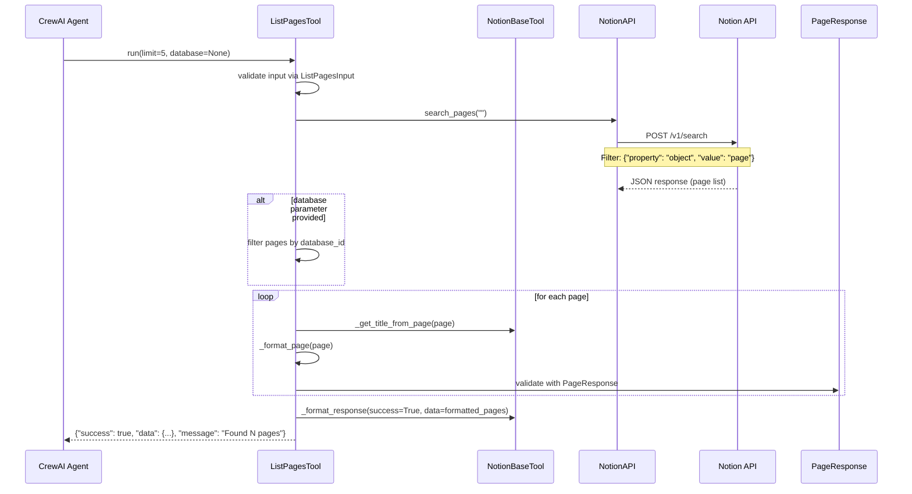
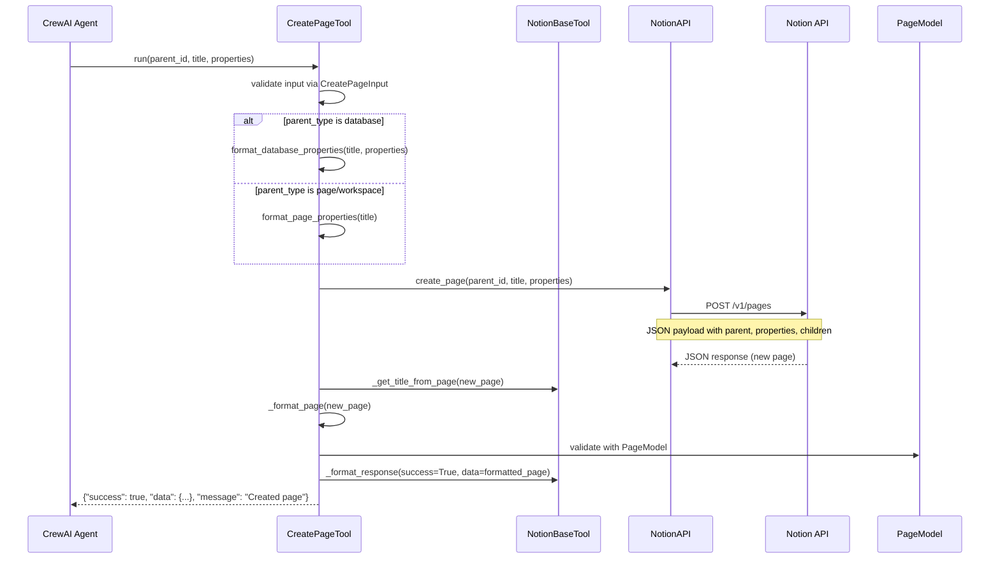
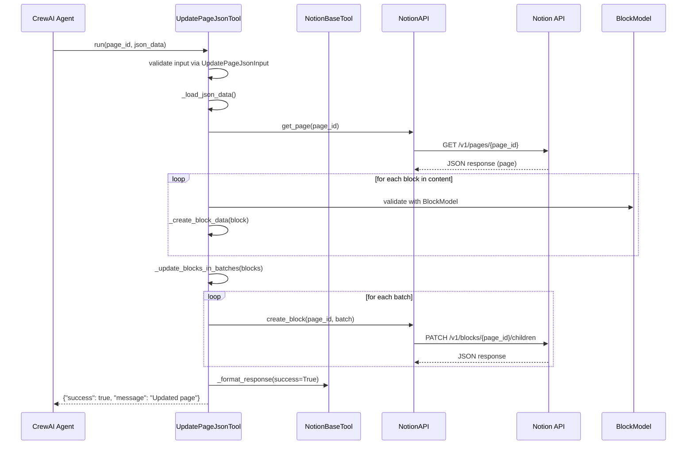
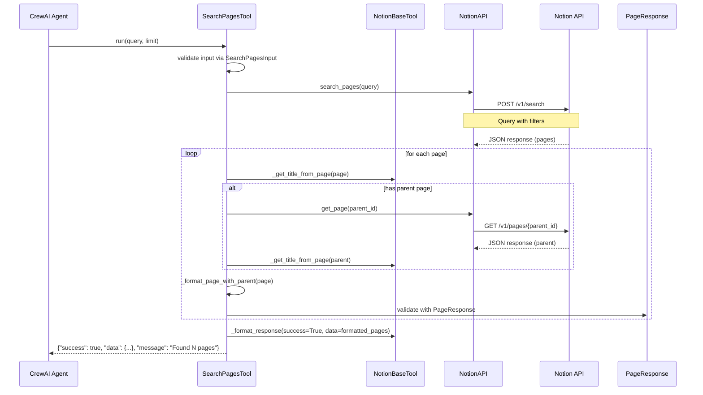
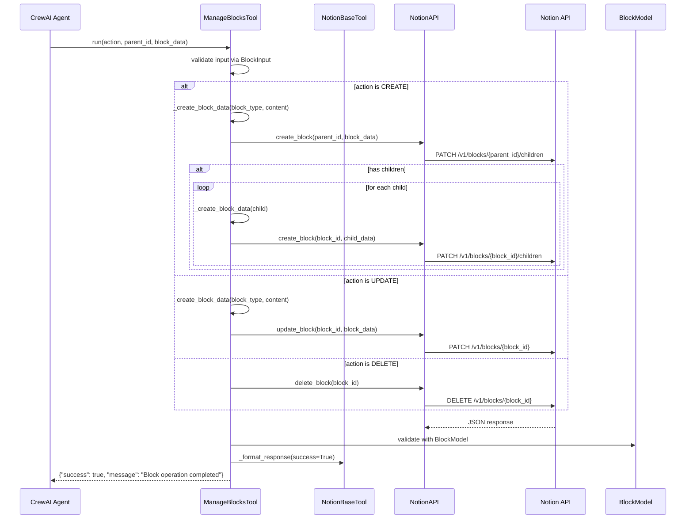

# Notion CrewAI Tools Implementation Guide

## Project Context
- Python 3.12.8
- CrewAI 0.95.0
- Environment and API keys already configured
- Focus: Direct conversion of Django commands to CrewAI tools
- Goal: Enable AI agents to interact with Notion via these tools

## Architecture Diagrams

### 1. Class Relationships


### 2. Tool Dependencies


### 3. Data Flow


### 4. Model Relationships


### 5. Component Architecture


### 6. Workflow Sequence Diagrams

#### List Pages Workflow


#### Create Page Workflow


#### Update Page JSON Workflow


#### Search Pages Workflow


#### Manage Blocks Workflow


These sequence diagrams illustrate:
1. The complete flow from agent request to response
2. All API calls made during tool execution
3. Data validation and transformation steps
4. Error handling points
5. Interaction between components
6. Batch processing for large operations

Each diagram shows:
- Component interactions
- API endpoints used
- Data flow direction
- Validation steps
- Response formatting
- Special case handling

## Implementation Approach

### 1. Tool Structure
```
notion/
├── tools/
│   ├── base.py           # Base tool and shared utilities
│   ├── models/           # Shared Pydantic models
│   │   ├── __init__.py
│   │   ├── page.py      # Page-related models
│   │   ├── block.py     # Block-related models
│   │   └── database.py  # Database-related models
│   ├── page/            # Page operation tools
│   ├── block/           # Block operation tools
│   └── database/        # Database operation tools
```

### 2. Quick Testing Method
```python
# Example test script (test_tool.py)
from notion.tools.page import ListPagesTool

def test_list_pages():
    tool = ListPagesTool()
    result = tool.run(limit=5)
    print(json.dumps(result, indent=2))

if __name__ == "__main__":
    test_list_pages()
```

### 3. Tool Implementation Template
```python
from typing import Dict, Any, Optional
from pydantic import BaseModel, Field
from ..base import NotionBaseTool
from ..models.page import PageResponse  # Shared models

class ToolNameInput(BaseModel):
    """Input schema for the tool"""
    param1: str = Field(..., description="Parameter description")
    param2: Optional[int] = Field(100, description="Optional parameter")

class ToolName(NotionBaseTool):
    name = "tool_name"
    description = "What this tool does"
    args_schema = ToolNameInput

    def _run(self, param1: str, param2: int = 100) -> Dict[str, Any]:
        try:
            # Implementation using self.api
            return self._format_response(
                success=True,
                data=result,
                message="Operation successful"
            )
        except Exception as e:
            return self._format_response(
                success=False,
                error=str(e),
                message="Operation failed"
            )
```

## Command Conversions

### 1. List Pages Command
[Previous implementation details remain the same...]

### 2. Create Page Command
[Previous implementation details remain the same...]

## Testing

### 1. Direct Tool Testing
```python
# Quick test during development
tool = ListPagesTool()
result = tool.run(limit=5)
print(json.dumps(result, indent=2))
```

### 2. Agent Testing
```python
from crewai import Agent, Task
from notion.tools.page import ListPagesTool

# Create agent with tool
agent = Agent(
    role='Notion Manager',
    goal='Manage Notion pages',
    backstory='I help manage and organize Notion pages',
    tools=[ListPagesTool()]
)

# Create task
task = Task(
    description='List the most recent pages',
    agent=agent
)

# Run task
result = task.execute()
```

## Implementation Notes

### 1. Key Points
- Reuse existing API client from Django commands
- Maintain consistent response format
- Focus on tool functionality first, optimization later
- Use type hints and docstrings for better agent interaction

### 2. Response Format
```python
{
    "success": bool,
    "message": str,      # Human-readable message
    "data": dict,        # Operation result
    "error": str | None  # Error message if failed
}
```

### 3. Common Patterns
```python
# Error handling
try:
    result = self.api.some_operation()
    return self._format_response(success=True, data=result)
except Exception as e:
    return self._format_response(
        success=False,
        error=str(e),
        message="Operation failed"
    )
```

## Next Steps
1. Implement base tool class
2. Convert highest-priority commands first:
   - List Pages
   - Create Page
   - Get Page
3. Test with CrewAI agent
4. Add remaining commands
5. Document agent usage examples

## Questions?
- Tool implementation: [Your Name/Contact]
- CrewAI integration: [Your Name/Contact]
- Testing: [Your Name/Contact] 

## Base Tool Implementation

### 1. Base Tool Class (`tools/base.py`)
```python
from typing import Dict, Any, Optional
from crewai.tools import BaseTool
from notion.management.commands.base import NotionAPI  # Reuse existing API

class NotionBaseTool(BaseTool):
    """Base class for all Notion tools"""
    
    def __init__(self):
        super().__init__()
        self.api = self._initialize_api()
    
    def _initialize_api(self) -> NotionAPI:
        """Reuse existing NotionAPI from Django commands"""
        return NotionAPI()  # This handles API key from environment
    
    def _format_response(
        self, 
        success: bool, 
        data: Any = None, 
        message: str = "",
        error: Optional[str] = None
    ) -> Dict[str, Any]:
        """Standardized response format for all tools"""
        return {
            "success": success,
            "message": message,
            "data": data,
            "error": error
        }

    def _get_title_from_page(self, page: Dict[str, Any]) -> str:
        """Reusable method for extracting page title"""
        title = page.get("properties", {}).get("title", {})
        if not title:
            return "Untitled"
        return "".join(
            text.get("plain_text", "") 
            for text in title.get("title", [])
        ) or "Untitled"
```

### 2. Shared Models (`tools/models/page.py`)
```python
from typing import Optional, Dict
from pydantic import BaseModel, Field

class PageParent(BaseModel):
    """Parent information for a page"""
    type: str = Field(..., description="Type of parent (workspace, page_id, database_id)")
    id: str = Field(..., description="ID of the parent")

class PageProperties(BaseModel):
    """Base properties for a page"""
    title: str = Field(..., description="Page title")
    
    @classmethod
    def from_notion_format(cls, title: str) -> Dict:
        """Convert string title to Notion API format"""
        return {
            "title": [
                {
                    "text": {
                        "content": title
                    }
                }
            ]
        }

class PageResponse(BaseModel):
    """Standard page response format"""
    id: str = Field(..., description="Page ID")
    title: str = Field(..., description="Page title")
    url: Optional[str] = Field(None, description="Page URL")
    parent: PageParent = Field(..., description="Parent information")
    created_time: Optional[str] = Field(None, description="Creation timestamp")
    last_edited_time: Optional[str] = Field(None, description="Last edit timestamp")
```

### 1. List Pages Command (`tools/page/list_pages.py`)
```python
from typing import Dict, List, Optional, Any
from pydantic import BaseModel, Field
from ..base import NotionBaseTool
from ..models.page import PageResponse

class ListPagesInput(BaseModel):
    """Input schema for list_pages tool"""
    database: Optional[str] = Field(
        None, 
        description="Database ID to filter pages from a specific database"
    )
    limit: int = Field(
        100, 
        description="Maximum number of pages to return",
        ge=1,
        le=1000
    )

class ListPagesTool(NotionBaseTool):
    name = "list_pages"
    description = "List all accessible Notion pages with optional database filter"
    args_schema = ListPagesInput
    
    def _run(
        self, 
        database: Optional[str] = None, 
        limit: int = 100
    ) -> Dict[str, Any]:
        """List Notion pages with optional database filter"""
        try:
            # Use empty query to list all pages
            pages = self.api.search_pages("")
            
            if not pages:
                return self._format_response(
                    success=True,
                    data={"pages": [], "total": 0, "limit": limit},
                    message="No pages found"
                )

            # Filter by database if specified
            if database:
                pages = [
                    page for page in pages 
                    if page.get("parent", {}).get("database_id") == database
                ]

            # Apply limit and format pages
            pages = pages[:limit]
            formatted_pages = [self._format_page(page) for page in pages]
            
            return self._format_response(
                success=True,
                data={
                    "pages": formatted_pages,
                    "total": len(pages),
                    "limit": limit
                },
                message=f"Found {len(pages)} pages"
            )

        except Exception as e:
            return self._format_response(
                success=False,
                error=str(e),
                message="Error listing pages"
            )
    
    def _format_page(self, page: Dict[str, Any]) -> Dict[str, Any]:
        """Format a page for the response"""
        return {
            "id": page["id"],
            "title": self._get_title_from_page(page),
            "parent": {
                "type": page.get("parent", {}).get("type", "unknown"),
                "id": self._get_parent_id(page.get("parent", {}))
            },
            "url": page.get("url"),
            "created_time": page.get("created_time"),
            "last_edited_time": page.get("last_edited_time")
        }
    
    def _get_parent_id(self, parent: Dict[str, Any]) -> str:
        """Extract parent ID based on type"""
        parent_type = parent.get("type", "unknown")
        if parent_type == "workspace":
            return "workspace"
        elif parent_type in ["page_id", "database_id"]:
            return parent.get(parent_type, "unknown")
        return "unknown"
```

## Testing Examples

### 1. Unit Testing (`tests/tools/test_page_tools.py`)
```python
import pytest
from notion.tools.page import ListPagesTool

@pytest.fixture
def sample_page():
    return {
        "id": "test-id",
        "parent": {"type": "workspace"},
        "properties": {
            "title": {
                "title": [
                    {"text": {"content": "Test Page"}}
                ]
            }
        },
        "url": "https://notion.so/test",
        "created_time": "2024-01-01T00:00:00Z",
        "last_edited_time": "2024-01-01T00:00:00Z"
    }

class TestListPagesTool:
    def test_format_page(self, sample_page):
        tool = ListPagesTool()
        result = tool._format_page(sample_page)
        assert result["id"] == "test-id"
        assert result["title"] == "Test Page"
        assert result["parent"]["type"] == "workspace"
        
    def test_list_pages_empty(self, mocker):
        tool = ListPagesTool()
        mocker.patch.object(tool.api, 'search_pages', return_value=[])
        result = tool.run()
        assert result["success"]
        assert len(result["data"]["pages"]) == 0
        
    def test_list_pages_with_database(self, mocker, sample_page):
        tool = ListPagesTool()
        mocker.patch.object(tool.api, 'search_pages', return_value=[sample_page])
        result = tool.run(database="test-db")
        assert result["success"]
``` 

## Special Cases and Caveats

### 1. JSON Updates (`tools/page/update_page_json.py`)

```python
from typing import Dict, Union, List
from pathlib import Path
from pydantic import BaseModel, Field, validator
from ..base import NotionBaseTool

class BlockContent(BaseModel):
    """Base model for block content"""
    type: str = Field(..., description="Block type (paragraph, heading_1, etc.)")
    content: str = Field(..., description="Block content")
    children: Optional[List['BlockContent']] = None  # Recursive for nested blocks

class PageUpdateInput(BaseModel):
    """Input schema for page update"""
    page_id: str = Field(..., description="ID of the page to update")
    json_file: Optional[Path] = Field(None, description="Path to JSON file")
    json_string: Optional[str] = Field(None, description="JSON string data")
    
    @validator('json_file')
    def validate_file(cls, v):
        if v and not v.exists():
            raise ValueError(f"File not found: {v}")
        return v

class UpdatePageJsonTool(NotionBaseTool):
    name = "update_page_json"
    description = "Update a Notion page using JSON input"
    args_schema = PageUpdateInput
    
    def _run(
        self,
        page_id: str,
        json_file: Optional[Path] = None,
        json_string: Optional[str] = None
    ) -> Dict[str, Any]:
        try:
            # Load JSON data
            data = self._load_json_data(json_file, json_string)
            
            # Validate page exists
            self.api.get_page(page_id)
            
            # Process updates in batches
            if "content" in data:
                self._update_blocks_in_batches(
                    page_id, 
                    data["content"],
                    batch_size=100  # Notion API limit
                )
            
            return self._format_response(
                success=True,
                message="Page updated successfully"
            )
            
        except Exception as e:
            return self._format_response(
                success=False,
                error=str(e),
                message="Failed to update page"
            )
    
    def _load_json_data(self, json_file: Optional[Path], json_string: Optional[str]) -> Dict:
        """Load and validate JSON data from file or string"""
        # Implementation details...
```

### 2. Block Management (`tools/block/manage_blocks.py`)

```python
from enum import Enum
from typing import List, Optional
from pydantic import BaseModel, Field

class BlockType(Enum):
    PARAGRAPH = "paragraph"
    HEADING_1 = "heading_1"
    DIVIDER = "divider"
    CALLOUT = "callout"
    TOGGLE = "toggle"
    # Add other block types...

class BlockAction(Enum):
    CREATE = "create"
    UPDATE = "update"
    DELETE = "delete"

class BlockInput(BaseModel):
    """Input schema for block management"""
    action: BlockAction
    parent_id: str = Field(..., description="ID of parent page/block")
    block_id: Optional[str] = Field(None, description="Required for update/delete")
    block_type: Optional[BlockType] = Field(None, description="Required for create/update")
    content: Optional[str] = Field(None, description="Block content")
    children: Optional[List[Dict]] = None

class ManageBlocksTool(NotionBaseTool):
    name = "manage_blocks"
    description = "Create, update, or delete Notion blocks"
    args_schema = BlockInput
    
    def _run(
        self,
        action: BlockAction,
        parent_id: str,
        block_id: Optional[str] = None,
        block_type: Optional[BlockType] = None,
        content: Optional[str] = None,
        children: Optional[List[Dict]] = None
    ) -> Dict[str, Any]:
        try:
            if action == BlockAction.CREATE:
                return self._create_block(
                    parent_id,
                    block_type,
                    content,
                    children
                )
            elif action == BlockAction.UPDATE:
                return self._update_block(
                    block_id,
                    block_type,
                    content
                )
            else:  # DELETE
                return self._delete_block(block_id)
                
        except Exception as e:
            return self._format_response(
                success=False,
                error=str(e),
                message=f"Failed to {action.value} block"
            )
```

### 3. Implementation Notes

1. **Batch Processing**
   ```python
   def _update_blocks_in_batches(
       self,
       page_id: str,
       blocks: List[Dict],
       batch_size: int = 100
   ):
       """Process blocks in batches to respect API limits"""
       for i in range(0, len(blocks), batch_size):
           batch = blocks[i:i + batch_size]
           self.api.create_block(page_id, batch)
   ```

2. **Special Block Types**
   ```python
   def _create_block_data(self, block_type: str, content: str) -> Dict:
       """Handle special block types"""
       if block_type == "divider":
           return {"type": block_type, block_type: {}}
           
       if block_type == "callout":
           icon, content = content.split(" ", 1) if " " in content else ("💡", content)
           return {
               "type": block_type,
               block_type: {
                   "rich_text": [{"text": {"content": content}}],
                   "icon": {"type": "emoji", "emoji": icon}
               }
           }
           
       # Default block structure
       return {
           "type": block_type,
           block_type: {
               "rich_text": [{"text": {"content": content}}]
           }
       }
   ```

3. **Nested Blocks**
   ```python
   def _process_nested_blocks(
       self,
       parent_id: str,
       blocks: List[Dict]
   ) -> List[str]:
       """Process blocks with children"""
       block_ids = []
       for block in blocks:
           result = self.api.create_block(parent_id, [block])
           block_id = result["results"][0]["id"]
           block_ids.append(block_id)
           
           if block.get("children"):
               self._process_nested_blocks(
                   block_id,
                   block["children"]
               )
       return block_ids
   ```

### 4. Testing Considerations

1. **JSON Update Testing**
   ```python
   def test_json_update_with_nested_blocks(self):
       """Test updating page with nested blocks"""
       data = {
           "content": [
               {
                   "type": "toggle",
                   "content": "Toggle Header",
                   "children": [
                       {"type": "paragraph", "content": "Child content"}
                   ]
               }
           ]
       }
       result = tool.run(
           page_id="test-id",
           json_string=json.dumps(data)
       )
       assert result["success"]
   ```

2. **Block Management Testing**
   ```python
   def test_special_block_types():
       """Test creating special block types"""
       tool = ManageBlocksTool()
       
       # Test callout block
       result = tool.run(
           action=BlockAction.CREATE,
           parent_id="test-id",
           block_type=BlockType.CALLOUT,
           content="⚠️ Important note"
       )
       assert result["success"]
       
       # Test nested toggle
       result = tool.run(
           action=BlockAction.CREATE,
           parent_id="test-id",
           block_type=BlockType.TOGGLE,
           content="Toggle Header",
           children=[{
               "type": BlockType.PARAGRAPH,
               "content": "Nested content"
           }]
       )
       assert result["success"]
   ``` 

### 3. Page Content Handling (`tools/page/get_page.py`)

```python
from typing import Dict, List, Optional, Any
from pydantic import BaseModel, Field
from ..base import NotionBaseTool

class GetPageInput(BaseModel):
    """Input schema for get_page tool"""
    page_id: str = Field(..., description="ID of the page to retrieve")
    include_content: bool = Field(
        False, 
        description="Include page content/blocks"
    )
    raw: bool = Field(
        False,
        description="Return raw API response"
    )
    show_ids: bool = Field(
        False,
        description="Include block IDs in response"
    )

class GetPageTool(NotionBaseTool):
    name = "get_page"
    description = "Get a Notion page by ID with optional content"
    args_schema = GetPageInput
    
    def _run(
        self,
        page_id: str,
        include_content: bool = False,
        raw: bool = False,
        show_ids: bool = False
    ) -> Dict[str, Any]:
        try:
            # Get page
            page = self.api.get_page(page_id)
            
            # Format response
            if raw:
                data = {"page": page}
            else:
                data = {
                    "page": self._format_page(page),
                    "content": self._get_content(page_id) if include_content else None
                }
            
            return self._format_response(
                success=True,
                data=data,
                message=f"Retrieved page: {self._get_title_from_page(page)}"
            )
            
        except Exception as e:
            return self._format_response(
                success=False,
                error=str(e),
                message="Failed to retrieve page"
            )
    
    def _format_block(
        self, 
        block: Dict[str, Any],
        show_ids: bool = False
    ) -> Dict[str, Any]:
        """Format a block with special type handling"""
        block_type = block.get("type")
        if not block_type:
            return {}
            
        # Get basic content
        content = self._get_rich_text_content(
            block.get(block_type, {}).get("rich_text", [])
        )
        
        # Base block format
        formatted = {
            "type": block_type,
            "content": content,
            "indent": block.get("indent", 0)
        }
        
        # Special block handling
        if block_type == "to_do":
            formatted["checked"] = block[block_type].get("checked", False)
        elif block_type == "code":
            formatted["language"] = block[block_type].get("language", "plain text")
        elif block_type == "callout":
            icon = block[block_type].get("icon", {})
            if icon.get("type") == "emoji":
                formatted["content"] = f"{icon.get('emoji', '')} {content}"
                
        # Add ID if requested
        if show_ids:
            formatted["id"] = block.get("id")
            
        # Handle children recursively
        if block.get("has_children"):
            formatted["children"] = self._get_block_children(
                block["id"],
                show_ids
            )
            
        return formatted
    
    def _get_block_children(
        self,
        block_id: str,
        show_ids: bool = False
    ) -> List[Dict[str, Any]]:
        """Get and format child blocks"""
        children = self.api.get_block_children(block_id)
        return [
            self._format_block(child, show_ids)
            for child in children
        ]
```

### 4. Search Functionality (`tools/page/search_pages.py`)

```python
from typing import Dict, List, Optional, Any
from pydantic import BaseModel, Field
from ..base import NotionBaseTool

class SearchPagesInput(BaseModel):
    """Input schema for search_pages tool"""
    query: str = Field(..., description="Search query")
    limit: int = Field(
        100,
        description="Maximum number of pages to return",
        ge=1,
        le=1000
    )

class SearchPagesTool(NotionBaseTool):
    name = "search_pages"
    description = "Search Notion pages by query"
    args_schema = SearchPagesInput
    
    def _run(
        self,
        query: str,
        limit: int = 100
    ) -> Dict[str, Any]:
        try:
            # Search pages
            pages = self.api.search_pages(query)
            
            if not pages:
                return self._format_response(
                    success=True,
                    data={
                        "pages": [],
                        "total": 0,
                        "limit": limit,
                        "query": query
                    },
                    message="No pages found matching query"
                )
            
            # Apply limit and format
            pages = pages[:limit]
            formatted_pages = [
                self._format_page_with_parent(page)
                for page in pages
            ]
            
            return self._format_response(
                success=True,
                data={
                    "pages": formatted_pages,
                    "total": len(pages),
                    "limit": limit,
                    "query": query
                },
                message=f"Found {len(pages)} pages matching query"
            )
            
        except Exception as e:
            return self._format_response(
                success=False,
                error=str(e),
                message="Error searching pages"
            )
    
    def _format_page_with_parent(
        self,
        page: Dict[str, Any]
    ) -> Dict[str, Any]:
        """Format page with resolved parent information"""
        formatted = self._format_page(page)
        parent = page.get("parent", {})
        parent_type = parent.get("type", "unknown")
        
        # Resolve parent title
        if parent_type == "page_id":
            parent_id = parent.get("page_id")
            try:
                parent_page = self.api.get_page(parent_id)
                parent_title = self._get_title_from_page(parent_page)
            except Exception:
                parent_title = "Unknown"
        elif parent_type == "workspace":
            parent_title = "Workspace"
        elif parent_type == "database_id":
            parent_title = "Database"
        else:
            parent_title = "Unknown"
            
        formatted["parent"]["title"] = parent_title
        return formatted
```

### 5. Testing Special Cases

```python
class TestGetPageTool:
    def test_special_block_types(self, mocker):
        """Test handling of special block types"""
        tool = GetPageTool()
        
        # Mock API responses
        mocker.patch.object(
            tool.api,
            'get_page',
            return_value={"id": "test-id"}
        )
        
        mocker.patch.object(
            tool.api,
            'get_block_children',
            return_value=[
                {
                    "type": "to_do",
                    "to_do": {
                        "rich_text": [{"text": {"content": "Task"}}],
                        "checked": True
                    }
                },
                {
                    "type": "code",
                    "code": {
                        "rich_text": [{"text": {"content": "print('hello')"}}],
                        "language": "python"
                    }
                }
            ]
        )
        
        result = tool.run(
            page_id="test-id",
            include_content=True
        )
        assert result["success"]
        
        blocks = result["data"]["content"]
        assert blocks[0]["type"] == "to_do"
        assert blocks[0]["checked"] == True
        assert blocks[1]["type"] == "code"
        assert blocks[1]["language"] == "python"

class TestSearchPagesTool:
    def test_parent_resolution(self, mocker):
        """Test parent title resolution"""
        tool = SearchPagesTool()
        
        # Mock search results
        mocker.patch.object(
            tool.api,
            'search_pages',
            return_value=[{
                "id": "page-id",
                "parent": {
                    "type": "page_id",
                    "page_id": "parent-id"
                }
            }]
        )
        
        # Mock parent page
        mocker.patch.object(
            tool.api,
            'get_page',
            return_value={
                "properties": {
                    "title": {
                        "title": [{"text": {"content": "Parent"}}]
                    }
                }
            }
        )
        
        result = tool.run(query="test")
        assert result["success"]
        assert result["data"]["pages"][0]["parent"]["title"] == "Parent"
``` 

### 5. Database Operations (`tools/database/list_databases.py`)

```python
from typing import Dict, List, Optional, Any
from pydantic import BaseModel, Field
from ..base import NotionBaseTool

class DatabaseResponse(BaseModel):
    """Database response model"""
    id: str = Field(..., description="Database ID")
    title: str = Field(..., description="Database title")
    url: Optional[str] = Field(None, description="Database URL")
    parent: Dict[str, str] = Field(..., description="Parent information")
    created_time: Optional[str] = Field(None, description="Creation timestamp")
    last_edited_time: Optional[str] = Field(None, description="Last edit timestamp")
    properties: Dict[str, Any] = Field(default_factory=dict, description="Database properties")

class ListDatabasesTool(NotionBaseTool):
    name = "list_databases"
    description = "List all accessible Notion databases"
    
    def _run(self) -> Dict[str, Any]:
        try:
            databases = self.api.list_databases()
            
            if not databases:
                return self._format_response(
                    success=True,
                    data={"databases": [], "total": 0},
                    message="No databases found"
                )
            
            formatted_databases = [
                self._format_database(db) 
                for db in databases
            ]
            
            return self._format_response(
                success=True,
                data={
                    "databases": formatted_databases,
                    "total": len(databases)
                },
                message=f"Found {len(databases)} databases"
            )
            
        except Exception as e:
            return self._format_response(
                success=False,
                error=str(e),
                message="Error listing databases"
            )
    
    def _format_database(self, database: Dict[str, Any]) -> Dict[str, Any]:
        """Format database with resolved parent information"""
        # Extract title
        title = self._get_database_title(database)
        
        # Get parent information
        parent_info = self._get_parent_info(database.get("parent", {}))
        
        return {
            "id": database["id"],
            "title": title,
            "parent": parent_info,
            "url": database.get("url"),
            "created_time": database.get("created_time"),
            "last_edited_time": database.get("last_edited_time"),
            "properties": database.get("properties", {})
        }
    
    def _get_database_title(self, database: Dict[str, Any]) -> str:
        """Extract database title"""
        if "title" not in database:
            return "Untitled"
            
        return "".join(
            text.get("plain_text", "")
            for text in database.get("title", [])
        ) or "Untitled"
```

### 6. Block Updates (`tools/block/update_block.py`)

```python
from typing import Dict, List, Optional, Any
from enum import Enum
from pydantic import BaseModel, Field
from ..base import NotionBaseTool

class BlockType(str, Enum):
    PARAGRAPH = "paragraph"
    HEADING_1 = "heading_1"
    HEADING_2 = "heading_2"
    HEADING_3 = "heading_3"
    TOGGLE = "toggle"
    BULLETED_LIST = "bulleted_list_item"
    NUMBERED_LIST = "numbered_list_item"
    TO_DO = "to_do"
    CODE = "code"
    QUOTE = "quote"
    CALLOUT = "callout"
    DIVIDER = "divider"

class ChildBlock(BaseModel):
    """Child block model for toggle blocks"""
    type: BlockType
    content: str

class UpdateBlockInput(BaseModel):
    """Input schema for block update"""
    block_id: str = Field(..., description="ID of block to update")
    block_type: BlockType = Field(..., description="Type of block")
    content: str = Field(..., description="Block content")
    child_content: Optional[List[ChildBlock]] = Field(
        None,
        description="Child blocks for toggle blocks"
    )

class UpdateBlockTool(NotionBaseTool):
    name = "update_block"
    description = "Update a Notion block's content"
    args_schema = UpdateBlockInput
    
    def _run(
        self,
        block_id: str,
        block_type: BlockType,
        content: str,
        child_content: Optional[List[ChildBlock]] = None
    ) -> Dict[str, Any]:
        try:
            # Create block data
            block_data = self._create_block_data(block_type, content)
            
            # Update main block
            self.api.update_block(block_id, block_data)
            
            # Handle children for toggle blocks
            if block_type == BlockType.TOGGLE and child_content:
                children = [
                    self._create_block_data(
                        child.type,
                        child.content
                    )
                    for child in child_content
                ]
                self.api.create_block(block_id, children)
            
            return self._format_response(
                success=True,
                message=f"Updated block and added {len(child_content or [])} children"
            )
            
        except Exception as e:
            return self._format_response(
                success=False,
                error=str(e),
                message="Failed to update block"
            )
    
    def _create_block_data(
        self,
        block_type: BlockType,
        content: str
    ) -> Dict[str, Any]:
        """Create block data structure for API"""
        if block_type == BlockType.DIVIDER:
            return {"type": block_type, block_type: {}}
            
        return {
            "type": block_type,
            block_type: {
                "rich_text": [{
                    "type": "text",
                    "text": {"content": content}
                }]
            }
        }
```

### 7. Testing Database and Block Operations

```python
class TestListDatabasesTool:
    def test_database_formatting(self, mocker):
        """Test database formatting with parent resolution"""
        tool = ListDatabasesTool()
        
        # Mock database response
        mocker.patch.object(
            tool.api,
            'list_databases',
            return_value=[{
                "id": "db-id",
                "title": [
                    {"type": "text", "plain_text": "Test DB"}
                ],
                "parent": {
                    "type": "page_id",
                    "page_id": "parent-id"
                }
            }]
        )
        
        # Mock parent page
        mocker.patch.object(
            tool.api,
            'get_page',
            return_value={
                "properties": {
                    "title": {
                        "title": [{"text": {"content": "Parent"}}]
                    }
                }
            }
        )
        
        result = tool.run()
        assert result["success"]
        db = result["data"]["databases"][0]
        assert db["title"] == "Test DB"
        assert db["parent"]["title"] == "Parent"

class TestUpdateBlockTool:
    def test_toggle_with_children(self, mocker):
        """Test updating toggle block with children"""
        tool = UpdateBlockTool()
        
        # Mock update and create
        update_mock = mocker.patch.object(tool.api, 'update_block')
        create_mock = mocker.patch.object(tool.api, 'create_block')
        
        result = tool.run(
            block_id="block-id",
            block_type=BlockType.TOGGLE,
            content="Toggle Header",
            child_content=[
                ChildBlock(
                    type=BlockType.PARAGRAPH,
                    content="Child paragraph"
                )
            ]
        )
        
        assert result["success"]
        assert update_mock.called
        assert create_mock.called
```

### 8. Implementation Notes

1. **Database Title Handling**
   ```python
   def _get_database_title(database: Dict[str, Any]) -> str:
       """
       Database titles are in a different format than page titles.
       They are directly in the 'title' field as an array of text objects.
       """
       return "".join(
           text.get("plain_text", "")
           for text in database.get("title", [])
       ) or "Untitled"
   ```

2. **Block Type Validation**
   ```python
   def _validate_block_type(block_type: str) -> bool:
       """
       Validate block type against Notion's supported types.
       Important for preventing API errors.
       """
       return block_type in BlockType.__members__
   ```

3. **Rich Text Handling**
   ```python
   def _create_rich_text(content: str) -> List[Dict[str, Any]]:
       """
       Create rich text array for Notion API.
       Used in both blocks and page properties.
       """
       return [{
           "type": "text",
           "text": {"content": content}
       }]
   ```

### 9. Command Router and Registration

```python
from typing import Dict, Type, List
from pathlib import Path
from importlib import import_module
from crewai.tools import BaseTool

class NotionToolRegistry:
    """Registry for all Notion tools"""
    
    def __init__(self):
        self._tools: Dict[str, Type[BaseTool]] = {}
        self._load_tools()
    
    def _load_tools(self):
        """Dynamically load all available tools"""
        tools_dir = Path(__file__).parent / "tools"
        
        # Load page tools
        self._load_directory_tools(tools_dir / "page")
        # Load block tools
        self._load_directory_tools(tools_dir / "block")
        # Load database tools
        self._load_directory_tools(tools_dir / "database")
    
    def _load_directory_tools(self, directory: Path):
        """Load tools from a specific directory"""
        if not directory.exists():
            return
            
        for file in directory.glob("*.py"):
            if file.stem.startswith("_"):
                continue
                
            try:
                module = import_module(
                    f"notion.tools.{directory.stem}.{file.stem}"
                )
                
                # Find tool classes in the module
                for attr_name in dir(module):
                    attr = getattr(module, attr_name)
                    if (isinstance(attr, type) and 
                        issubclass(attr, BaseTool) and 
                        attr != BaseTool):
                        self._tools[attr.name] = attr
                        
            except ImportError as e:
                print(f"Failed to load tool {file.stem}: {e}")
    
    def get_tool(self, name: str) -> Type[BaseTool]:
        """Get a tool by name"""
        return self._tools.get(name)
    
    def get_all_tools(self) -> List[Type[BaseTool]]:
        """Get all registered tools"""
        return list(self._tools.values())
```

### 10. Simple CRUD Operations

```python
from typing import Dict, Any
from pydantic import BaseModel, Field
from ..base import NotionBaseTool

class DeletePageInput(BaseModel):
    """Input schema for delete_page tool"""
    page_id: str = Field(
        ..., 
        description="ID of the page to delete"
    )

class DeletePageTool(NotionBaseTool):
    name = "delete_page"
    description = "Delete (archive) a Notion page"
    args_schema = DeletePageInput
    
    def _run(self, page_id: str) -> Dict[str, Any]:
        try:
            # Get page first to include title in response
            page = self.api.get_page(page_id)
            title = self._get_title_from_page(page)
            
            # Delete the page
            self.api.delete_page(page_id)
            
            return self._format_response(
                success=True,
                message=f"Deleted page: {title}"
            )
            
        except Exception as e:
            return self._format_response(
                success=False,
                error=str(e),
                message="Failed to delete page"
            )
```

### 11. Tool Organization Best Practices

1. **Directory Structure**
   ```
   notion/
   ├── tools/
   │   ├── __init__.py          # Exports all tools
   │   ├── registry.py          # Tool registry
   │   ├── base.py              # Base tool class
   │   ├── models/              # Shared models
   │   ├── page/                # Page operations
   │   │   ├── __init__.py
   │   │   ├── list_pages.py
   │   │   ├── create_page.py
   │   │   └── delete_page.py
   │   ├── block/               # Block operations
   │   └── database/            # Database operations
   ```

2. **Tool Registration**
   ```python
   # tools/__init__.py
   from .registry import NotionToolRegistry
   from .page import *
   from .block import *
   from .database import *
   
   # Create registry instance
   registry = NotionToolRegistry()
   
   # Export all tools
   __all__ = [
       tool.__name__
       for tool in registry.get_all_tools()
   ]
   ```

3. **Tool Usage**
   ```python
   from notion.tools import registry
   
   # Get specific tool
   delete_tool = registry.get_tool("delete_page")()
   
   # Get all tools for an agent
   agent = Agent(
       role="Notion Manager",
       tools=registry.get_all_tools()
   )
   ```

### 12. Testing Simple Operations

```python
class TestDeletePageTool:
    def test_delete_page_success(self, mocker):
        """Test successful page deletion"""
        tool = DeletePageTool()
        
        # Mock get_page and delete_page
        mocker.patch.object(
            tool.api,
            'get_page',
            return_value={
                "properties": {
                    "title": {
                        "title": [{"text": {"content": "Test Page"}}]
                    }
                }
            }
        )
        delete_mock = mocker.patch.object(tool.api, 'delete_page')
        
        result = tool.run(page_id="test-id")
        assert result["success"]
        assert "Test Page" in result["message"]
        assert delete_mock.called
        
    def test_delete_page_not_found(self, mocker):
        """Test deleting non-existent page"""
        tool = DeletePageTool()
        
        # Mock get_page to raise exception
        mocker.patch.object(
            tool.api,
            'get_page',
            side_effect=Exception("Page not found")
        )
        
        result = tool.run(page_id="invalid-id")
        assert not result["success"]
        assert "Failed to delete page" in result["message"]
```

### 13. Implementation Notes

1. **Tool Registration**
   ```python
   def register_tool(tool_class: Type[BaseTool]):
       """Decorator to register a tool"""
       registry.register(tool_class)
       return tool_class
   
   @register_tool
   class MyTool(NotionBaseTool):
       pass
   ```

2. **Simple Operation Pattern**
   ```python
   def _run_simple_operation(
       self,
       operation: Callable,
       success_message: str,
       error_message: str,
       **kwargs
   ) -> Dict[str, Any]:
       """Template for simple operations"""
       try:
           result = operation(**kwargs)
           return self._format_response(
               success=True,
               data=result,
               message=success_message
           )
       except Exception as e:
           return self._format_response(
               success=False,
               error=str(e),
               message=error_message
           )
   ```

### 14. Core API Implementation

```python
import os
import requests
from typing import Dict, List, Optional
from dotenv import load_dotenv

class NotionAPI:
    """Core Notion API client used by all tools"""
    
    def __init__(self):
        load_dotenv()
        self.token = os.getenv("NOTION_API_KEY")
        if not self.token:
            raise ValueError("NOTION_API_KEY environment variable is required")
            
        self.base_url = "https://api.notion.com/v1"
        self.headers = {
            "Authorization": f"Bearer {self.token}",
            "Notion-Version": "2022-06-28",
            "Content-Type": "application/json"
        }
    
    def list_databases(self) -> List[Dict]:
        """List all accessible Notion databases"""
        endpoint = f"{self.base_url}/search"
        data = {"filter": {"property": "object", "value": "database"}}
        response = requests.post(endpoint, headers=self.headers, json=data)
        response.raise_for_status()
        return response.json().get("results", [])
    
    def search_pages(self, query: str) -> List[Dict]:
        """Search pages with query"""
        endpoint = f"{self.base_url}/search"
        data = {
            "query": query,
            "filter": {"property": "object", "value": "page"}
        }
        response = requests.post(endpoint, headers=self.headers, json=data)
        response.raise_for_status()
        return response.json().get("results", [])
    
    def create_page(
        self,
        parent_id: str,
        title: str,
        properties: Optional[Dict] = None,
        parent_type: str = "page_id"
    ) -> Dict:
        """Create a new page"""
        endpoint = f"{self.base_url}/pages"
        
        # Handle parent type
        parent = (
            {"workspace": True}
            if parent_type == "workspace"
            else {parent_type: parent_id}
        )
        
        # Handle properties based on parent type
        if parent_type == "database_id":
            page_properties = {
                "title": {"title": [{"text": {"content": title}}]}
            }
            if properties:
                page_properties.update(properties)
        else:
            page_properties = properties or {}
            
        data = {
            "parent": parent,
            "properties": page_properties
        }
        
        # Add content for non-database pages
        if parent_type != "database_id":
            data["children"] = [{
                "object": "block",
                "type": "heading_1",
                "heading_1": {
                    "rich_text": [{
                        "type": "text",
                        "text": {"content": title}
                    }]
                }
            }]
            
        response = requests.post(endpoint, headers=self.headers, json=data)
        response.raise_for_status()
        return response.json()
    
    def get_page(self, page_id: str) -> Dict:
        """Get page by ID"""
        endpoint = f"{self.base_url}/pages/{page_id}"
        response = requests.get(endpoint, headers=self.headers)
        response.raise_for_status()
        return response.json()
    
    def get_block_children(
        self,
        block_id: str,
        page_size: int = 100
    ) -> List[Dict]:
        """Get child blocks"""
        endpoint = f"{self.base_url}/blocks/{block_id}/children"
        params = {"page_size": page_size}
        response = requests.get(
            endpoint,
            headers=self.headers,
            params=params
        )
        response.raise_for_status()
        return response.json().get("results", [])
    
    def update_page(self, page_id: str, properties: Dict) -> Dict:
        """Update page properties"""
        endpoint = f"{self.base_url}/pages/{page_id}"
        response = requests.patch(
            endpoint,
            headers=self.headers,
            json={"properties": properties}
        )
        response.raise_for_status()
        return response.json()
    
    def delete_page(self, page_id: str) -> Dict:
        """Archive/delete a page"""
        endpoint = f"{self.base_url}/pages/{page_id}"
        response = requests.patch(
            endpoint,
            headers=self.headers,
            json={"archived": True}
        )
        response.raise_for_status()
        return response.json()
    
    def create_block(self, page_id: str, blocks: List[Dict]) -> Dict:
        """Create new blocks in a page"""
        endpoint = f"{self.base_url}/blocks/{page_id}/children"
        response = requests.patch(
            endpoint,
            headers=self.headers,
            json={"children": blocks}
        )
        response.raise_for_status()
        return response.json()
    
    def update_block(self, block_id: str, block_data: Dict) -> Dict:
        """Update a block"""
        endpoint = f"{self.base_url}/blocks/{block_id}"
        response = requests.patch(
            endpoint,
            headers=self.headers,
            json=block_data
        )
        response.raise_for_status()
        return response.json()
    
    def delete_block(self, block_id: str) -> Dict:
        """Delete a block"""
        endpoint = f"{self.base_url}/blocks/{block_id}"
        response = requests.delete(endpoint, headers=self.headers)
        response.raise_for_status()
        return response.json()
```

### 15. API Integration Notes

1. **Error Handling**
   ```python
   from requests.exceptions import RequestException

   try:
       result = self.api.some_operation()
   except RequestException as e:
       return self._format_response(
           success=False,
           error=f"API Error: {str(e)}",
           message="Failed to communicate with Notion API"
       )
   except Exception as e:
       return self._format_response(
           success=False,
           error=str(e),
           message="Unexpected error occurred"
       )
   ```

2. **Rate Limiting**
   ```python
   from time import sleep
   from functools import wraps

   def rate_limit(max_retries: int = 3, delay: float = 0.5):
       def decorator(func):
           @wraps(func)
           def wrapper(*args, **kwargs):
               for i in range(max_retries):
                   try:
                       return func(*args, **kwargs)
                   except RequestException as e:
                       if i == max_retries - 1:
                           raise
                       sleep(delay * (i + 1))
               return func(*args, **kwargs)
           return wrapper
       return decorator
   ```

3. **API Version Handling**
   ```python
   class NotionAPI:
       SUPPORTED_VERSIONS = ["2022-06-28"]
       
       def __init__(self, version: str = "2022-06-28"):
           if version not in self.SUPPORTED_VERSIONS:
               raise ValueError(
                   f"Unsupported API version. Use one of: {self.SUPPORTED_VERSIONS}"
               )
           self.headers = {
               "Notion-Version": version,
               # ... other headers
           }
   ```


## Testing Plan

### 1. Unit Testing Checklist

#### Base Tool Tests
```python
def test_base_tool():
    """Test suite for NotionBaseTool"""
    tests = [
        # API Initialization
        test_api_key_missing(),
        test_api_key_invalid(),
        test_api_version_unsupported(),
        
        # Response Formatting
        test_success_response_format(),
        test_error_response_format(),
        test_empty_response_format(),
        
        # Utility Methods
        test_get_title_from_page_empty(),
        test_get_title_from_page_malformed(),
        test_get_title_from_page_unicode()
    ]
```

#### Page Tools Test Matrix
| Test Case | List Pages | Create Page | Update Page | Delete Page | Get Page | Search Pages |
|-----------|------------|-------------|-------------|-------------|-----------|--------------|
| Empty Input | ✓ | ✓ | ✓ | ✓ | ✓ | ✓ |
| Invalid ID | - | ✓ | ✓ | ✓ | ✓ | - |
| Rate Limit | ✓ | ✓ | ✓ | ✓ | ✓ | ✓ |
| Permission Error | ✓ | ✓ | ✓ | ✓ | ✓ | ✓ |
| Large Response | ✓ | - | - | - | ✓ | ✓ |
| Unicode Content | ✓ | ✓ | ✓ | - | ✓ | ✓ |
| Special Characters | - | ✓ | ✓ | - | - | ✓ |
| Nested Content | - | ✓ | ✓ | - | ✓ | - |

#### Block Tools Test Matrix
| Test Case | Create Block | Update Block | Delete Block | Manage Blocks |
|-----------|--------------|--------------|--------------|---------------|
| Invalid Type | ✓ | ✓ | - | ✓ |
| Nested Blocks | ✓ | ✓ | ✓ | ✓ |
| Empty Content | ✓ | ✓ | - | ✓ |
| Special Blocks | ✓ | ✓ | - | ✓ |
| Max Children | ✓ | - | - | ✓ |
| Batch Updates | - | - | - | ✓ |

### 2. Integration Testing

#### Agent Integration Tests
```python
from crewai import Agent, Task, Process
from notion.tools import registry

def test_agent_integration():
    """Test suite for CrewAI agent integration"""
    
    # Setup test environment
    tools = registry.get_all_tools()
    agent = Agent(
        role="Notion Manager",
        goal="Test Notion operations",
        backstory="I am testing Notion tools",
        tools=tools
    )
    
    # Test scenarios
    scenarios = [
        # Basic Operations
        Task(
            description="Create a new page and verify its content",
            agent=agent
        ),
        Task(
            description="Search for pages and update their properties",
            agent=agent
        ),
        Task(
            description="Manage blocks with nested content",
            agent=agent
        ),
        
        # Complex Workflows
        Task(
            description="Create a page hierarchy with mixed content",
            agent=agent
        ),
        Task(
            description="Batch update multiple pages and verify changes",
            agent=agent
        ),
        
        # Error Handling
        Task(
            description="Handle invalid operations gracefully",
            agent=agent
        )
    ]
    
    # Run scenarios
    process = Process(tasks=scenarios)
    results = process.run()
```

#### API Integration Tests
```python
def test_api_integration():
    """Test suite for Notion API integration"""
    tests = [
        # Authentication
        test_api_auth_flow(),
        test_token_refresh(),
        test_invalid_token_handling(),
        
        # Rate Limiting
        test_rate_limit_handling(),
        test_concurrent_requests(),
        test_backoff_strategy(),
        
        # Error Handling
        test_network_errors(),
        test_timeout_handling(),
        test_malformed_responses()
    ]
```

### 3. Load Testing

#### Performance Test Suite
```python
import locust

class NotionToolUser(locust.HttpUser):
    """Load testing for Notion tools"""
    
    @locust.task(1)
    def test_read_operations(self):
        """Test read operations under load"""
        self.client.get("/list_pages")
        self.client.get("/search_pages?query=test")
        
    @locust.task(2)
    def test_write_operations(self):
        """Test write operations under load"""
        self.client.post("/create_page", json={
            "title": "Test Page",
            "content": "Test content"
        })
        
    @locust.task(3)
    def test_complex_operations(self):
        """Test complex operations under load"""
        self.client.post("/manage_blocks", json={
            "action": "create",
            "blocks": [{"type": "paragraph", "content": "Test"}]
        })
```

#### Load Test Scenarios
1. **Baseline Performance**
   - 10 concurrent users
   - 100 requests per second
   - Monitor response times and error rates

2. **Moderate Load**
   - 50 concurrent users
   - 500 requests per second
   - Test rate limiting and queuing

3. **Heavy Load**
   - 100 concurrent users
   - 1000 requests per second
   - Verify system stability

4. **Stress Test**
   - Gradually increase to 500 users
   - Monitor system degradation
   - Test recovery behavior

### 4. Error Handling Tests

```python
def test_error_scenarios():
    """Test suite for error handling"""
    
    # API Errors
    test_cases = [
        # Authentication Errors
        ("invalid_token", 401),
        ("expired_token", 401),
        ("missing_token", 401),
        
        # Permission Errors
        ("unauthorized_access", 403),
        ("insufficient_permissions", 403),
        
        # Resource Errors
        ("page_not_found", 404),
        ("block_not_found", 404),
        
        # Rate Limiting
        ("too_many_requests", 429),
        
        # Server Errors
        ("internal_server_error", 500),
        ("service_unavailable", 503)
    ]
    
    for error_type, status_code in test_cases:
        test_error_handling(error_type, status_code)
```

### 5. Testing Utilities

```python
class NotionTestClient:
    """Test client for Notion tools"""
    
    def __init__(self):
        self.api = NotionAPI()
        self.test_data = self._load_test_data()
    
    def _load_test_data(self) -> Dict[str, Any]:
        """Load test data from fixtures"""
        with open("tests/fixtures/test_data.json") as f:
            return json.load(f)
    
    def create_test_page(self) -> str:
        """Create a test page and return its ID"""
        response = self.api.create_page(
            parent_id="test_parent",
            title="Test Page",
            properties=self.test_data["page_properties"]
        )
        return response["id"]
    
    def cleanup_test_data(self):
        """Clean up test data after tests"""
        for page_id in self.test_data["cleanup_ids"]:
            try:
                self.api.delete_page(page_id)
            except Exception:
                pass
```

### 6. Test Coverage Requirements

#### Minimum Coverage Targets
- Unit Tests: 90% code coverage
- Integration Tests: 80% workflow coverage
- Error Handling: 100% error case coverage

#### Coverage Reporting
```python
def generate_coverage_report():
    """Generate test coverage report"""
    import coverage
    
    cov = coverage.Coverage()
    cov.start()
    
    # Run test suites
    run_unit_tests()
    run_integration_tests()
    run_error_tests()
    
    cov.stop()
    cov.save()
    
    # Generate reports
    cov.html_report(directory="coverage_report")
```

### 7. Continuous Integration

```yaml
# .github/workflows/test.yml
name: Notion Tools Tests

on: [push, pull_request]

jobs:
  test:
    runs-on: ubuntu-latest
    steps:
      - uses: actions/checkout@v2
      
      - name: Set up Python
        uses: actions/setup-python@v2
        with:
          python-version: "3.12.8"
          
      - name: Install dependencies
        run: |
          pip install -r requirements.txt
          pip install -r requirements-test.txt
          
      - name: Run unit tests
        run: pytest tests/unit
        
      - name: Run integration tests
        run: pytest tests/integration
        
      - name: Run load tests
        run: locust -f tests/load/locustfile.py --headless
        
      - name: Generate coverage report
        run: |
          coverage run -m pytest
          coverage report
          coverage html
```